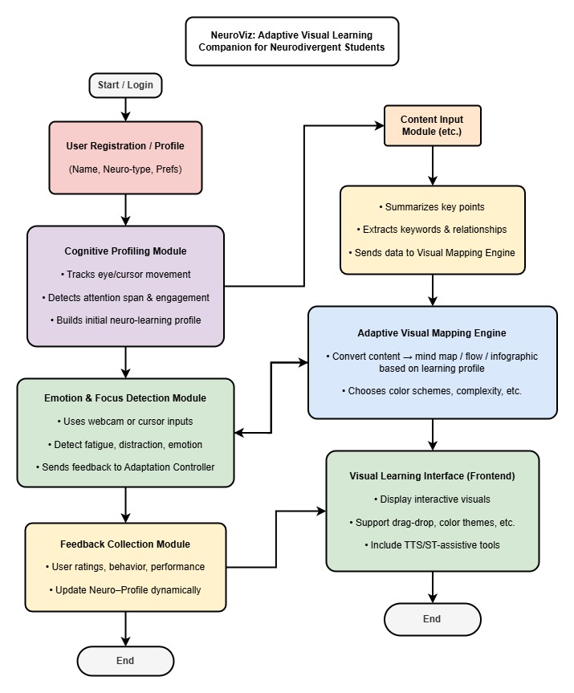

<div align="center">

# 🧠 NeuroViz Backend

### An Adaptive Visual Learning Companion for Neurodivergent Students

[](https://nodejs.org/en)
[](https://www.typescriptlang.org/)
[](https://expressjs.com/)
[](https://www.prisma.io/)
[](https://www.postgresql.org/)
[](LICENSE)

</div>

---

## 📖 Table of Contents

- [Overview](#-project-overview)
- [Core Capabilities](#-core-capabilities)
- [Tech Stack](#️-tech-stack)
- [Hosting & External Platforms](#-hosting--external-platforms)
- [Prerequisites](#-prerequisites)
- [Project Setup](#-project-setup)
- [Scripts](#-scripts)
- [Folder Structure](#-backend-folder-structure)
- [Dataflow Diagrams](#-backend-dataflow-diagram-till-now)
- [API Endpoints](#-api-endpoints)
- [System Architecture (Flow Summary)](#-system-architecture-flow-summary)
- [Graceful Shutdown](#-graceful-shutdown)
- [Future Enhancements](#-future-enhancements)
- [License](#-license)
- [Acknowledgements](#-acknowledgements)
- [Team](#-team)

---

## 🚀 Project Overview

Welcome to the **NeuroViz Backend** — the server-side engine powering **NeuroViz**, a neuro-assistive mind-mapping and visualization platform.

Built with [Node.js](https://nodejs.org/en), [TypeScript](https://www.typescriptlang.org/), [Express](https://expressjs.com/), and [Prisma ORM](https://www.prisma.io/), running on [PostgreSQL](https://www.postgresql.org/) (hosted on [NeonDB](https://neon.com/)).

**NeuroViz** is an AI-powered adaptive visual learning system designed to support *neurodivergent learners* (e.g. students with ADHD, Autism, Dyslexia, etc.) by transforming educational content into interactive visual formats — **mind maps, infographics, and visual flows** — tailored to individual cognitive and emotional profiles.

NeuroViz focuses on enhancing comprehension, retention, and engagement through **adaptive visualization**, analyzing a student's behavior, emotional state, and learning preferences to dynamically adjust how content is presented.

The backend is a scalable, AI-powered system providing secure REST APIs for:

- 🔐 User authentication & profile management
- 🗺️ Mind map creation, retrieval, and updates
- 🗄️ Database operations via Prisma ORM
- ⚙️ Clean error handling & modular architecture
- 👥 Admin, Teacher, and Student route handling

It also drives AI-based mind map generation, NLP processing, cognitive & emotion profiling, and adaptive learning triggers — ensuring personalized experiences for neurodivergent students.

---

## ✨ Core Capabilities

| Capability | Description |
|---|---|
| 🔑 **Secure Authentication & RBAC** | JWT-based login with role enforcement for Student, Teacher, and Admin via middleware |
| 👤 **User & Profile Management** | Centralized user APIs with independent cognitive and emotional profiling for long-term personalization |
| 🧠 **AI-Powered Mind Map Engine** | Manual and AI-generated mind maps with storage, export (JPEG/PDF), and teacher review workflows |
| 📝 **NLP & AI Processing** | Text summarization, keyword extraction, sentiment analysis, NER, classification, and toxicity detection |
| 📊 **Cognitive Profiling System** | Dynamic tracking of attention, engagement, and learning preferences to adapt content delivery |
| 😊 **Emotion & Focus Tracking** | Emotion logging with trend analysis (stress, fatigue, motivation) for adaptive learning triggers |
| 🎯 **Adaptive Learning Engine** | Automatically adjusts visualization complexity, UI, and content strategy using cognitive–emotional signals |
| 🧑‍🏫 **Teacher Intelligence Layer** | Analytics-driven tools for assignments, grading, mind map review, student groups, and AI insights |
| 📈 **Teacher Dashboard & Insights** | Class heatmaps, progress tracking, student comparison, feedback, and notification systems |
| 🛠️ **Admin Control & Observability** | System health monitoring, user management, activity logs, and usage analytics |
| 🏗️ **Robust Architecture** | Modular, feature-based design with Prisma ORM, clean separation of concerns, and scalable structure |
| 🛡️ **Security & Reliability** | Middleware authorization, DTO validation, activity auditing, and graceful shutdown handling |
| 🎓 **Target Users** | Built for neurodivergent students, insight-driven educators, inclusive institutions, and learning researchers |

---

## 🏗️ Tech Stack
 
| Category | Technology |
|---|---|
| Language | TypeScript |
| Framework | Express.js |
| ORM | Prisma |
| Auth Strategy | JWT (custom) + Google OAuth2 |
| Real-time / Live Room | Socket.io, LiveKit SDK |
| NLP (local) | wink-nlp |
| NLP (remote inference) | Hugging Face Models, Python microservices (summarizer, toxicity, sentiment, keywords, classify, NER) |
| Email Sending | Nodemailer (or similar SMTP client) |
| File Uploads | Cloudinary SDK |
| Environment Management | dotenv |
| Build Tool | tsc |
| Dev Runner | ts-node-dev |
 
## ☁️ Hosting & External Platforms
 
| Category | Platform / Service |
|---|---|
| Database Hosting | NeonDB (PostgreSQL) |
| Auth Provider | Google Cloud Console (OAuth Client) |
| Python Microservice Hosting | Custom deploy (Render / Railway / Fly.io, etc.) |
| ML Inference Provider | Hugging Face Inference API |
| ML Inference Provider (optional) | OpenAI API |
| Email Delivery | SMTP Provider (Mailtrap / Gmail / SendGrid) |
| Live Video/Audio Infra | LiveKit Cloud |
| Media Storage/CDN | Cloudinary |
| App Hosting (Backend) | Render |
| Frontend Hosting | Vercel |

---

## 📋 Prerequisites

### Node.js & npm

Install **Node.js** and **npm** (Node Package Manager).

🔗 [Download from the official site](https://nodejs.org/en/download)

**Or install via terminal:**

```bash
# Linux (Debian or Ubuntu-based)
sudo apt update
sudo apt install -y curl
curl -fsSL https://deb.nodesource.com/setup_18.x | sudo -E bash -
sudo apt install -y nodejs

# macOS
brew install node

# Verify installation
node -v
npm -v
```

### Yarn

```bash
npm install --global yarn
# or
npm install -g yarn
```

---

## 🚀 Project Setup

**1. Clone the repo**

```bash
git clone https://github.com/ProgrammerSnehasish/NeuroViz-backend
cd NeuroViz-backend
```

**2. Install dependencies**

```bash
yarn config set nodeLinker node-modules   # safety: avoids npm/yarn collisions
yarn install
```

**3. Initialize Prisma**

```bash
yarn prisma migrate dev --name update_name   # developers only
yarn prisma generate
```

**4. Build the project**

```bash
yarn build
```

**5. Start the development server**

```bash
yarn dev
```

---

## 🧰 Scripts

| Command | Description |
|---|---|
| `yarn dev` | Start dev server using ts-node-dev |
| `yarn build` | Compile TypeScript to JavaScript (`dist/`) |
| `yarn start` | Run compiled server from `dist/` |
| `yarn prisma migrate` | Run database migrations |
| `yarn prisma generate` | Generate Prisma client |
| `yarn prisma studio` | Launch Prisma Studio (DB GUI) |
| `yarn lint` | Check TypeScript errors |

---

## 📁 Backend Folder Structure

```bash
NeuroViz-backend/
├── .yarn/                          # Not committed
│   └── install-state.gz
│
├── prisma/
│   ├── schema.prisma
│   └── migrations/
│
├── src/
│   ├── app.ts
│   ├── server.ts
│   │
│   ├── auth/
│   │   ├── auth.controller.ts
│   │   ├── auth.service.ts
│   │   ├── auth.helper.ts
│   │   ├── auth.dto.ts
│   │   └── auth.routes.ts
│   │
│   ├── base/
│   │   ├── base.router.ts
│   │   ├── ActivityLogService.ts
│   │   └── interface.ts
│   │
│   ├── config/
│   │   ├── core.ts
│   │   ├── cloudinary.ts
│   │   └── database.ts
│   │
│   ├── features/
│   │   ├── admin/
│   │   │   ├── admin.controller.ts
│   │   │   ├── admin.dto.ts
│   │   │   ├── admin.router.ts
│   │   │   └── admin.service.ts
│   │   │
│   │   ├── general_feedback/
│   │   │   ├── feedback.controller.ts
│   │   │   ├── feedback.dto.ts
│   │   │   ├── feedback.router.ts
│   │   │   └── feedback.service.ts
│   │   │
│   │   ├── live_class/
│   │   │   ├── liveClass.dto.ts
│   │   │   ├── livekit.service.ts
│   │   │   └── room.routes.ts
│   │   │
│   │   ├── mindmap/
│   │   │   ├── controller/
│   │   │   │   ├── mindmap.controller.ts
│   │   │   │   ├── mindmap.export.controller.ts
│   │   │   │   └── mindmap.extended.controller.ts
│   │   │   ├── dto/
│   │   │   │   ├── mindmap.dto.ts
│   │   │   │   └── mindmap.extended.dto.ts
│   │   │   ├── feedback/
│   │   │   │   ├── mindmap-feedback.controller.ts
│   │   │   │   ├── mindmap-feedback.dto.ts
│   │   │   │   └── mindmap-feedback.service.ts
│   │   │   ├── service/
│   │   │   │   ├── mindmap.ai.service.ts
│   │   │   │   ├── mindmap.audio.service.ts
│   │   │   │   ├── mindmap.document.service.ts
│   │   │   │   ├── mindmap.export.service.ts
│   │   │   │   ├── mindmap.extended.service.ts
│   │   │   │   ├── mindmap.neurodivergent.service.ts
│   │   │   │   ├── mindmap.service.ts
│   │   │   │   ├── mindmap.tts.service.ts
│   │   │   │   └── mindmap.video.service.ts
│   │   │   ├── mindmap.router.ts
│   │   │   └── mindmap.type.ts
│   │   │
│   │   ├── newsletter/
│   │   │   ├── newsletter.controller.ts
│   │   │   ├── newsletter.dto.ts
│   │   │   ├── newsletter.router.ts
│   │   │   └── newsletter.service.ts
│   │   │
│   │   ├── nlp/
│   │   │   ├── nlp.controller.ts
│   │   │   ├── nlp.dto.ts
│   │   │   ├── nlp.router.ts
│   │   │   └── nlp.service.ts
│   │   │
│   │   ├── student/
│   │   │   ├── student.controller.ts
│   │   │   ├── student.router.ts
│   │   │   └── student.service.ts
│   │   │
│   │   ├── teachers/
│   │   │   ├── Dashboard/
│   │   │   │   ├── teacher.dashboard.controller.ts
│   │   │   │   ├── teacher.dashboard.dto.ts
│   │   │   │   ├── teacher.dashboard.router.ts
│   │   │   │   └── teacher.dashboard.service.ts
│   │   │   ├── Services/
│   │   │   │   ├── teacher.assignment.service.ts
│   │   │   │   ├── teacher.mail-log.service.ts
│   │   │   │   ├── teacher.review.service.ts
│   │   │   │   ├── teacher.service.ts
│   │   │   │   ├── teacher.student.service.ts
│   │   │   │   └── teacher.verification.service.ts
│   │   │   ├── teacher.controller.ts
│   │   │   ├── teacher.dto.ts
│   │   │   └── teacher.router.ts
│   │   │
│   │   └── user/
│   │       ├── user.controller.ts
│   │       ├── user.dto.ts
│   │       ├── user.interface.ts
│   │       ├── user.router.ts
│   │       └── user.service.ts
│   │
│   ├── middlewares/
│   │   ├── dtoValidation.ts
│   │   ├── enforceAdmin.ts
│   │   ├── enforceStudent.ts
│   │   ├── enforceTeacher.ts
│   │   ├── enforceTeacherorStudent.ts
│   │   ├── enforceTeacherStudentRelation.ts
│   │   ├── enforceVerifiedTeacher.ts
│   │   ├── errorHandler.ts
│   │   ├── jwtVerifiction.ts
│   │   ├── requireAuth.ts
│   │   ├── responseHandler.ts
│   │   └── upload.ts
│   │
│   ├── sockets/
│   │   └── room.socket.ts
│   │
│   ├── types/
│   │   ├── express.d.ts
│   │   ├── node-wav.d.ts
│   │   └── whisper-node.d.ts
│   │
│   └── utils/
│       ├── env.ts
│       ├── getUserDetailsbyRole.ts
│       ├── HMACtoken.ts
│       ├── mailer.ts
│       ├── newsletterMailer.ts
│       ├── passwordGenerator.ts
│       ├── resolveUserFromToken.ts
│       ├── tokenCleanup.ts
│       ├── uploadCertification.ts
│       ├── uploadPhoto.ts
│       ├── uploadSubmission.ts
│       └── util.ts
│
├── .env                             # Not committed
├── .env.example                           
├── .gitignore
├── .yarnrc.yml
├── LICENSE                          # MIT License
├── prisma.config.js
├── package.json
├── tsconfig.json
├── yarn.lock
└── README.md
```

---

## 🔄 Backend Dataflow Diagram (Till Now)


---

## 🌐 API Endpoints

> **Base Route (Backend):** `https://neuroviz-backend.onrender.com/api`

### 🔐 Authentication

| Method | Route | Description |
|---|---|---|
| POST | `/auth/signup` | Create new user / signup |
| POST | `/auth/signin` | Signin / Login |
| POST | `/auth/otp/request` | Request OTP for OTP-based login |
| POST | `/auth/otp/verify` | Verify OTP for OTP-based login |
| POST | `/auth/password/forgot` | Forgot password |
| POST | `/auth/password/verify-otp` | Verify OTP for password reset |
| POST | `/auth/password/reset` | Reset password |
| POST | `/auth/google` | Google OAuth Signin/Signup *(TODO)* |
| POST | `` | Passkey-based Signin *(TODO)* |
| POST | `/auth/signout` | Signout |

### 👤 User

| Method | Route | Description |
|---|---|---|
| GET | `/users/email/:email` | Get user by email |
| GET | `/users/:id` | Get user by id |
| PUT | `/users/update` | Update user details |
| DELETE | `/users/delete/:id` | Delete user by id |

### 🗺️ Mindmap

| Method | Route | Description |
|---|---|---|
| POST | `/mindmap/create` | Create mindmap |
| POST | `/mindmap/generate` | Generate mindmap using AI from text (paragraph or keywords) |
| POST | `/mindmap/audio` | Generate mindmap from a single audio file (`audio/mpeg`, `audio/mp4`, `audio/webm`, `audio/ogg`, `audio/wav`, `audio/flac`, `audio/aac` — max 50MB) |
| POST | `/mindmap/document` | Generate mindmap from a single document (`application/pdf`, `.docx`, `text/plain`, `text/markdown` — max 20MB) |
| POST | `/mindmap/video` | Generate mindmap from a single video file (`video/mp4`, `video/webm`, `video/quicktime`, `video/x-msvideo` — max 500MB) |
| POST | `/mindmap/youtube` | Generate mindmap from a YouTube link |
| POST | `/mindmap/tts/text` | Text-to-Speech for text |
| POST | `/mindmap/tts/mindmap` | Text-to-Speech for mindmap |
| GET | `/mindmap/:mindmapId/focus?nodeIndex=_` | Focus on a single node of a mindmap |
| GET | `/mindmap/:mindmapId/simplified?addEmojis=true&maxWords=12` | Get simplified mindmap |
| GET | `/mindmap/:mindmapId/quiz` | Get sample quiz questions for a mindmap |
| GET | `/mindmap/:mindmapId/study-plan?nodesPerBlock=_` | Get study plan of a mindmap |
| GET | `/mindmap/:mindmapId/colours` | Fetch node colours by mindmap id |
| GET | `/mindmap/:mindmapId/analogies` | Fetch analogies per node |
| GET | `/mindmap/:mindmapId` | Get mindmap by id |
| GET | `/mindmap/user/:userId` | Get mindmaps by user id |
| PUT | `/mindmap/update/:mindmapId` | Update mindmap by id |
| GET | `/mindmap/:mindmapId/jpeg` | Download mindmap as JPEG *(recommended from frontend, not part of backend)*|
| GET | `/mindmap/:mindmapId/pdf` | Download mindmap as PDF *(recommended from frontend, not part of backend)*|
| DELETE | `/mindmap/delete/:mindmapId` | Delete mindmap by id |

**Feedback routes**
| Method | Route | Auth | Description |
|---|---|---|---|
| `POST` | `/mindmap/feedback` | Teacher / Student | Give feedback on a mindmap |
| `GET` | `/mindmap/my/feedbacks` | Teacher / Student | Get all my mindmap feedbacks |
| `GET` | `/mindmap/:mapId/all/feedbacks` | Teacher / Student | Get all feedbacks for a specific mindmap |
| `GET` | `/mindmap/:mapId/my/feedback` | Teacher / Student | Get my feedback for a specific mindmap |
| `PATCH` | `/mindmap/:feedbackId` | Teacher / Student | Update own feedback |
| `DELETE` | `/mindmap/:feedbackId` | Teacher / Student | Delete own feedback |

### 🎥 Live Class

| Method | Route | Description |
|---|---|---|
| POST | `/rooms/` | Create a new room |
| POST | `/rooms/:roomId/join` | Join a room, get LiveKit token |
| POST | `/rooms/:roomId/end` | Host ends the class |
| GET | `/rooms/:roomId/participants` | Get participants by room id |

### 📝 NLP

| Method | Route | Description |
|---|---|---|
| POST | `/nlp/summarize` | Summarize text |
| POST | `/nlp/detect-toxicity` | Detect toxicity |
| POST | `/nlp/sentiment` | Sentiment analysis |
| POST | `/nlp/keywords` | Extract keywords |
| POST | `/nlp/classify` | Classify text |
| POST | `/nlp/entities` | Named entity recognition |

### 🧑‍🏫 Teacher Routes

**Pre Publish**
| Method | Route | Description |
|---|---|---|
| GET | `/teacher/verification/submit` | Submit Profile for Verification and Publish |
| GET | `/teacher/verification/status` | Get Verification Status |

**Analytics & Performance**

| Method | Route | Description |
|---|---|---|
| GET | `/teacher/students/:studentId/analytics` | Get analytics for a specific student |
| GET | `/teacher/students/:studentId/summary` | Summarize student performance |
| GET | `/teacher/students/:studentId/progress` | Get progress data for a student |
| POST | `/teacher/mindmap/:mindmapId/review` | Review or approve a mindmap |
| GET | `/teacher/mindmaps` | Get mindmap management overview |
| GET | `/teacher/class-overview` | Get teacher's overall class overview |

**Assignments**

| Method | Route | Description |
|---|---|---|
| POST | `/teacher/assignment` | Create a new assignment |
| GET | `/teacher/assignments` | Get all assignments created by teacher |
| GET | `/teacher/assignment/:assignmentId` | Get specific assignment details |
| PATCH | `/teacher/assignment/:assignmentId` | Update an existing assignment |
| DELETE | `/teacher/assignment/:assignmentId` | Delete an assignment |
| POST | `/teacher/assignment/:assignmentId/evaluate/:submissionId` | Evaluate a specific student submission |
| GET | `/teacher/students/:studentId/submissions` | Get all submissions for a student |

**Review**

| Method | Route | Description |
|---|---|---|
| GET | `/teacher/review/submissions` | Get all submissions for teacher |
| GET | `/teacher/review/submissions/pending` | Get all pending submissions |
| GET | `/teacher/review/submissions/:submissionId` | Get a specific submission |
| POST | `/teacher/review/:submissionId` | Review and grade a submission |
| POST | `/teacher/review/bulk/:assignmentId` | Bulk review all submissions for an assignment |
| POST | `/teacher/review/:submissionId/regenerate` | Regenerate AI summary for submission |

**Student Management**

| Method | Route | Description |
|---|---|---|
| GET | `/teacher/students` | Get student management overview |
| GET | `/teacher/students/search` | Search students by name or email |
| POST | `/teacher/students/register` | Register a new student under the teacher |
| DELETE | `/teacher/students/:studentId/unregister` | Unregister a student from teacher |
| POST | `/teacher/students/invite` | Invite a student by email |

**Groups**

| Method | Route | Description |
|---|---|---|
| GET | `/teacher/groups` | Get all groups |
| POST | `/teacher/group/create` | Create a new student group |
| PATCH | `/teacher/group/:groupId` | Update group details |
| DELETE | `/teacher/group/:groupId` | Delete a group |
| POST | `/teacher/students/group/:groupId/members/add` | Add multiple students to a group |
| POST | `/teacher/student/group/:groupId/member/:studentId/add` | Add a single student to a group |
| DELETE | `/teacher/student/group/:groupId/member/:studentId` | Remove a student from a group |
| POST | `/teacher/student/group/:groupId/invite` | Invite a student by email to a group |

**Mail Logs**

| Method | Route | Description |
|---|---|---|
| GET | `/teacher/mail-logs` | Get recent mail logs for teacher |
| GET | `/teacher/mail-log/:mailId` | Get specific mail log by ID |

### 📊 Teacher Dashboard Routes

**Overview & Heatmap**

| Method | Route | Description |
|---|---|---|
| GET | `/teacher/dashboard` | Get complete teacher dashboard overview |
| GET | `/teacher/dashboard/analytics` | Get analytics overview |
| GET | `/teacher/dashboard/heatmap` | Get class heatmap for engagement |

**Student Progress**

| Method | Route | Description |
|---|---|---|
| GET | `/teacher/student/:studentId/progress` | Get progress data for a student |
| GET | `/teacher/student/:studentId/report` | Get detailed performance report |
| GET | `/teacher/student/:studentId/strategy` | Get adaptive strategy for student |
| GET | `/teacher/student/compare` | Compare progress between students |

**Class Insights**

| Method | Route | Description |
|---|---|---|
| GET | `/teacher/class/strategy` | Get adaptive class strategy |
| GET | `/teacher/dashboard/teaching/insights` | Get adaptive teaching insights |
| GET | `/teacher/dashboard/assignments/insights` | Get assignment insights |

**Notifications**

| Method | Route | Description |
|---|---|---|
| GET | `/teacher/dashboard/notifications` | Get all notifications for teacher |
| POST | `/teacher/dashboard/notification/post` | Post a new notification to students |
| PATCH | `/teacher/dashboard/notifications/:id/read` | Mark a notification as read |
| PATCH | `/teacher/dashboard/notifications/read-all` | Mark all notifications as read |
| POST | `/teacher/dashboard/broadcast` | Broadcast an announcement to all students |

**Teacher Feedback**

| Method | Route | Description |
|---|---|---|
| POST | `/teacher/dashboard/feedback` | Submit feedback for a student |
| GET | `/teacher/dashboard/feedback/overview` | Get feedback overview |

---

### 📰 Newsletter Routes

**Public**

| Method | Route | Auth | Description |
|---|---|---|---|
| `POST` | `/newsletter/subscribe` | None | Subscribe to the newsletter |
| `POST` | `/newsletter/unsubscribe` | None | Unsubscribe from the newsletter |

**Admin**

| Method | Route | Auth | Description |
|---|---|---|---|
| `POST` | `/newsletter/createDraft` | Admin | Create a new newsletter draft |
| `GET` | `/newsletter/fetchAll` | Admin | Get all newsletters |
| `GET` | `/newsletter/subscribers` | Admin | Get all subscribers |
| `GET` | `/newsletter/:newsletterId` | Admin | Get a specific newsletter by ID |
| `PATCH` | `/newsletter/:newsletterId` | Admin | Update a draft newsletter |
| `DELETE` | `/newsletter/:newsletterId` | Admin | Delete a draft newsletter |
| `POST` | `/newsletter/:newsletterId/send` | Admin | Send newsletter to subscribers |
| `GET` | `/newsletter/:newsletterId/logs` | Admin | Get send logs for a newsletter |

---

### 🛠️ Admin Dashboard(Routes)

**System Overview**

| Method | Route                  | Description                             |
| ------ | ---------------------- | --------------------------------------- |
| GET    | `/admin/overview`      | Get complete admin dashboard overview   |
| GET    | `/admin/health`        | Get system health status                |
| GET    | `/admin/activity/logs` | Get recent administrative activity logs |

---

**👥 User Management**

| Method | Route                       | Description                           |
| ------ | --------------------------- | ------------------------------------- |
| GET    | `/admin/users`              | Get all registered users              |
| GET    | `/admin/user/:userId`       | Get details of a specific user        |
| PATCH  | `/admin/user/status`        | Update user account status            |
| DELETE | `/admin/user/:userId`       | Delete a user account                 |
| DELETE | `/admin/user/:userId/reset` | Reset all data associated with a user |

---

**💬 Feedback Management**

| Method | Route                                | Description                      |
| ------ | ------------------------------------ | -------------------------------- |
| GET    | `/admin/feedback`                    | Get all user feedback            |
| GET    | `/admin/feedback/stats`              | Get feedback statistics          |
| GET    | `/admin/feedback/:feedbackId`        | Get details of specific feedback |
| PATCH  | `/admin/feedback/:feedbackId/status` | Update feedback review status    |
| DELETE | `/admin/feedback/:feedbackId`        | Delete a feedback entry          |

---

**📧 Mail Logs**

| Method | Route                     | Description                        |
| ------ | ------------------------- | ---------------------------------- |
| GET    | `/admin/mail/logs`        | Get all mail logs                  |
| GET    | `/admin/mail/log/:mailId` | Get details of a specific mail log |
| GET    | `/admin/mail/stats`       | Get mail delivery statistics       |

---

**📰 Newsletter**

| Method | Route                     | Description                            |
| ------ | ------------------------- | -------------------------------------- |
| GET    | `/admin/newsletter/stats` | Get newsletter subscription statistics |

---

**👨‍🏫 Teacher–Student Management**

| Method | Route                                | Description                            |
| ------ | ------------------------------------ | -------------------------------------- |
| GET    | `/admin/teacher-students`            | Get all teacher–student relationships  |
| GET    | `/admin/teacher/:teacherId/students` | Get all students assigned to a teacher |

---

**👥 Group Management**

| Method | Route                   | Description                     |
| ------ | ----------------------- | ------------------------------- |
| GET    | `/admin/groups`         | Get all platform groups         |
| GET    | `/admin/group/:groupId` | Get details of a specific group |
| DELETE | `/admin/group/:groupId` | Delete a group                  |

---

**🔔 Notifications**

| Method | Route                           | Description                           |
| ------ | ------------------------------- | ------------------------------------- |
| POST   | `/admin/notification/broadcast` | Broadcast a notification to all users |

---

**📈 Analytics**

| Method | Route                        | Description              |
| ------ | ---------------------------- | ------------------------ |
| GET    | `/admin/analytics/cognitive` | Get cognitive analytics  |
| GET    | `/admin/analytics/emotions`  | Get emotion analytics    |
| GET    | `/admin/analytics/behavior`  | Get behavioral analytics |

---

**✅ Teacher Verification**

| Method | Route                                   | Description                                      |
| ------ | --------------------------------------- | ------------------------------------------------ |
| GET    | `/admin/verification/requests`          | Get all pending teacher verification requests    |
| PATCH  | `/admin/verification/:teacherId/review` | Approve or reject a teacher verification request |

---

### 💬 Site Feedback Routes

**User**

| Method | Route | Description |
|---|---|---|
| POST | `/feedback/submit` | Submit site feedback (email-based, no auth required) |
| GET | `/feedback/fetch` | Get own submitted feedbacks |
| GET | `/feedback/fetch/:feedbackId` | Get a specific own feedback |
| DELETE | `/feedback/:feedbackId` | Delete own feedback (only if PENDING) |

<details>
<summary>🚧 Planned Routes (Admin, Behavior, Cognitive/Emotion Profiling, etc.)</summary>

**Behavior Tracking**

| Method | Route | Description |
|---|---|---|
| POST | `/behavior/track` | Track user behaviour for cognitive profiling |

**Cognitive Profiling**

| Method | Route | Description |
|---|---|---|
| GET | `/cognitive/user/:userId` | Get cognitive profile by user id |

**Emotion Profiling**

| Method | Route | Description |
|---|---|---|
| POST | `/emotion/log` | Log new emotion |
| GET | `/emotion/user/:userId` | Get emotion log by user id |


**Others**

| Method | Route | Description |
|---|---|---|
| POST | `/adapt/trigger/user/:userid` | Trigger adaptation manually (interface adaptation) |
| POST | `/content/summarize` | Summarize content |

</details>

---

## 🧩 System Architecture (Flow Summary)

### 1️⃣ User Registration / Profile
- Collects user details: name, neuro-type, and learning preferences
- Initializes a personalized learning session

### 2️⃣ Cognitive Profiling Module
- Tracks eye/cursor movement and attention span
- Detects engagement levels
- Builds an initial neuro-learning profile for each user

### 3️⃣ Content Input Module
- Accepts learning content (text, notes, documents, etc.)
- Automatically:
  - Summarizes key points
  - Extracts keywords and relationships
  - Sends structured data to the Visual Mapping Engine

### 4️⃣ Adaptive Visual Mapping Engine
- Converts summarized content into visual representations (mind maps, infographics, flow diagrams)
- Adapts visual elements based on user profile (color themes, complexity levels, layout styles)

### 5️⃣ Visual Learning Interface (Frontend)
- Displays interactive visualizations
- Supports drag-and-drop, color customization, and TTS/STT assistive tools for accessibility
- Provides a user-friendly experience optimized for different neuro-types

### 6️⃣ Emotion & Focus Detection Module
- Uses webcam or cursor tracking to monitor fatigue, distraction, and emotional cues
- Sends real-time feedback to the adaptation system for live adjustments

### 7️⃣ Feedback Collection Module
- Gathers user feedback based on ratings, engagement, and performance data
- Dynamically updates the Neuro–Learning Profile for continuous personalization

### 📐 Architecture Diagram

> *NeuroViz: Adaptive Visual Learning Companion for Neurodivergent Students*



---

## 🧠 Core Features (Platform)

- Adaptive visualization based on learning type
- Emotion-aware and attention-responsive interface
- AI summarization and keyword extraction
- Continuous personalization via user feedback
- Multi-format visual outputs (mind map, infographic, flowchart)
- Accessibility tools: Text-to-Speech (TTS) and Speech-to-Text (STT)

---

## 🎯 Objectives

1. Support neurodivergent learners through tailored visual learning
2. Reduce cognitive overload by adapting visual complexity
3. Enhance focus and retention using emotion-aware feedback loops
4. Build an inclusive, assistive educational platform

---

## 🧹 Graceful Shutdown

On **`Ctrl+C`** or stop signal:

- Prisma disconnects cleanly
- Server closes connections gracefully

**Logs:**
```
🛑 Shutting down gracefully...
🧹 Prisma disconnected and server closed.
```

---

## 🧭 Future Enhancements

- [ ] Attribute-Based Access Control (for Admin login)
- [ ] Role-Based Access Control (RBAC)
- [ ] AI-based mindmap generation
- [ ] Caching and performance optimization
- [ ] GraphQL API support
- [ ] Real-time video lecture room
- [ ] Calendar sync
- [ ] Voice assistant support
- [ ] Integration with Learning Management Systems (LMS)
- [ ] Gamified learning dashboards and analytics
- [ ] Multi-language and voice-assistive support
- [ ] Advanced emotion tracking via micro-expressions

---

## 📜 License

This project is licensed under the **MIT License** — see the [LICENSE](LICENSE) file for details.

---

## 🙌 Acknowledgements

Thanks to the open-source community and all the contributors to this repo! 💜

---

## 👥 Team

### Author

<table>
  <tr>
    <td align="center">
      <a href="https://github.com/ProgrammerSnehasish">
        <br/>
        <b>Snehasish Das</b><br/>
        <sub>Full Stack Developer • Cyber Security Enthusiast • NeuroViz Project Member</sub>
      </a>
    </td>
  </tr>
</table>

### Collaborators

<table>
  <tr>
    <td align="center">
      <a href="https://github.com/Rounakgithub22">
        <br/>
        <b>Rounak Saha</b><br/>
        <sub>Backend Developer • Cyber Security Enthusiast • NeuroViz Project Lead</sub>
      </a>
    </td>
    <td align="center">
      <a href="https://github.com/Puskar-Sarkar">
        <br/>
        <b>Puskar Sarkar</b><br/>
        <sub>Full Stack Developer and Tester • Cyber Security Enthusiast • NeuroViz Project Member</sub>
      </a>
    </td>
    <td align="center">
      <a href="https://github.com/SagnikaMitra">
        <br/>
        <b>Sagnika Mitra</b><br/>
        <sub>Frontend Web Developer • Cyber Security Enthusiast • NeuroViz Project Member</sub>
      </a>
    </td>
  </tr>
</table>

---

<div align="center">

### 🧩 NeuroViz — Empowering neurodivergent learners with intelligent visualization

*Every mind learns visually, effectively, and confidently.*

</div>
